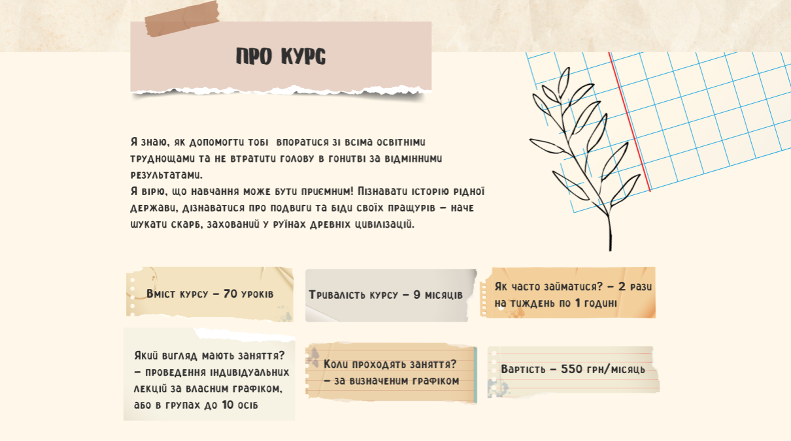
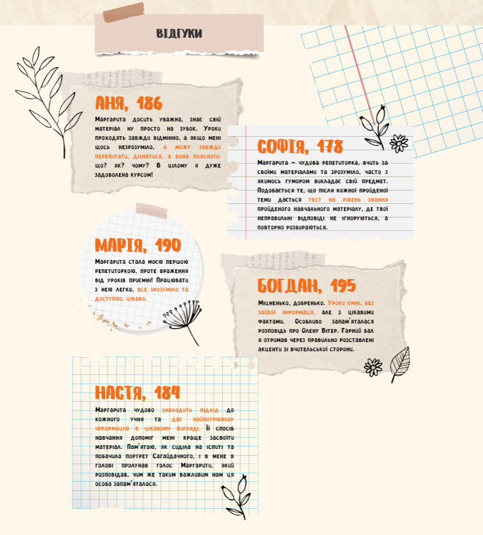

# Tutoring Course

WordPress theme for advertising training courses.

- The first 4 sections, a mobile menu and a modal window have been developed.
- The ACF PRO plugin has been used.
- Implemented adaptive, cross-browser, accessible, SEO-adapted markup. Sass preprocessor and BEM methodology used.

<figure>
  
  <figcaption>Section "Hero"</figcaption>
</figure style="margin-bottom: 10px;">

<figure>
  
  <figcaption>Section "About"</figcaption>
</figure>

<figure>
  
  <figcaption>Section "Advantages"</figcaption>
</figure>

<figure>
  
  <figcaption>Section "Reviews"</figcaption>
</figure>

<figure>
  
  <figcaption>Modal window</figcaption>
</figure>

<figure>
  
  <figcaption>Mobile menu</figcaption>
</figure>

## Note

Settings for ACF PRO are in plugins-settings/acf-pro.json

## Commands:

- npm install - installs npm-dependencies into the project.
- npm run build - launches Gulp.
